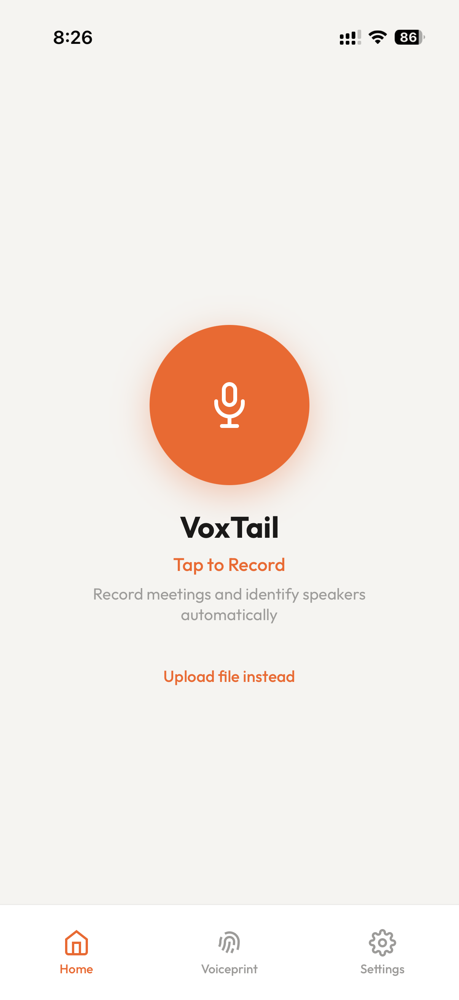
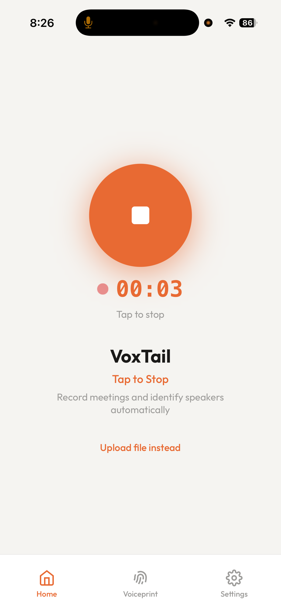
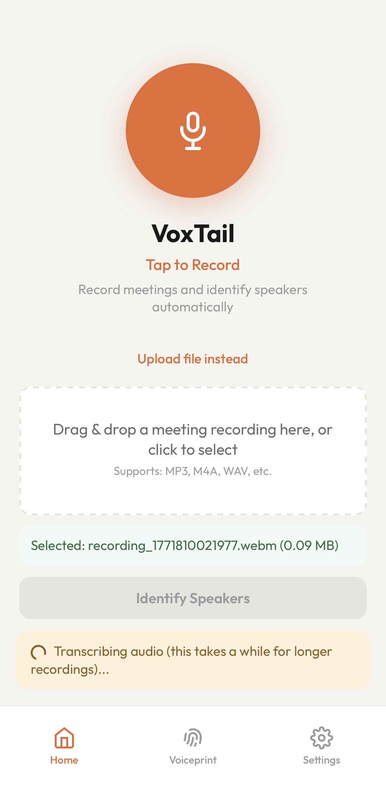
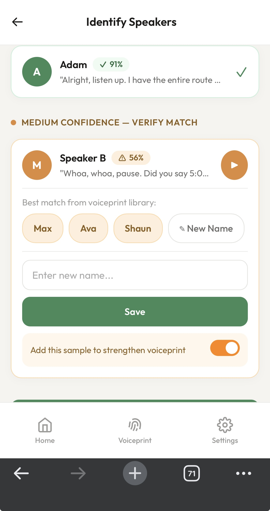
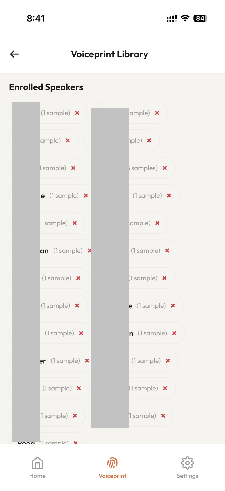
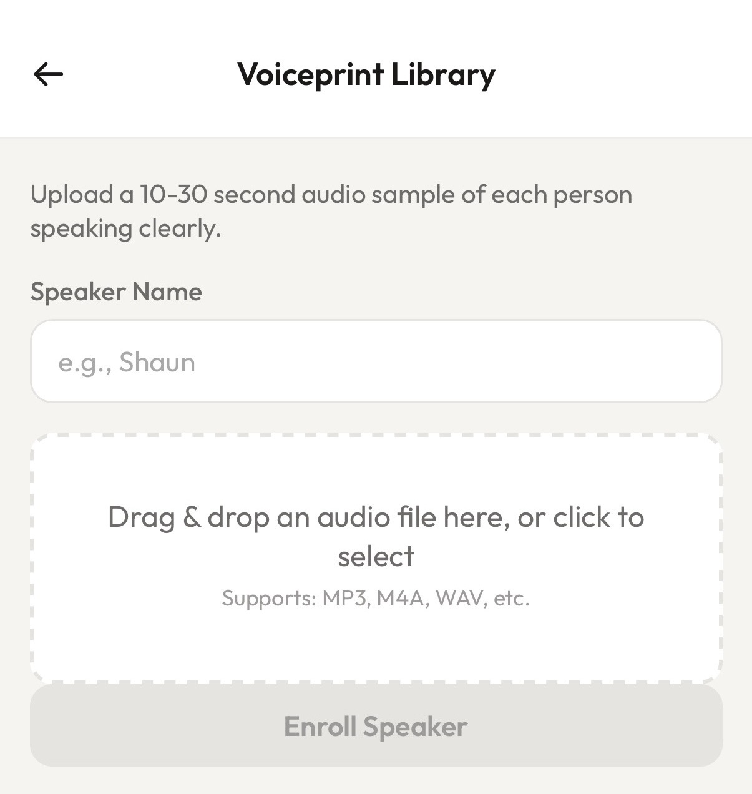

# VoxTail

**Speaker recognition for meetings — know WHO said what.**

Enroll speakers via voice samples, record or upload meetings, and get AI-powered transcripts with speaker labels and summaries. Works on desktop and mobile as a PWA.

## Features

- **Speaker Enrollment** — Build voice profiles from short audio samples
- **Meeting Identification** — Automatically label who said what with confidence levels
- **AI Summaries** — Executive summary, action items, key decisions via OpenAI GPT
- **Audio Clip Playback** — Listen to speaker clips to verify identity
- **Slack & Google Drive** — Share summaries to Slack or save as Google Docs
- **Installable PWA** — Add to home screen, works on phone and desktop

## How It Works

```
                          VoxTail Pipeline

  Audio File ──► AssemblyAI ──► SpeechBrain ──► Pinecone ──► Results
   (upload/       (transcribe    (extract        (match       (labeled
    record)        + diarize)     embeddings)     speakers)    transcript)
                                                      │
                                                      ▼
                                                   OpenAI GPT
                                                  (AI summary)
```

1. Upload a meeting recording or record live from your microphone
2. AssemblyAI transcribes the audio and separates speakers (diarization)
3. SpeechBrain ECAPA-TDNN extracts a 192-dimensional voice embedding per speaker
4. Pinecone matches embeddings against enrolled voice profiles
5. You review results — confirm uncertain matches, enroll new speakers
6. OpenAI generates an executive summary with action items and decisions

## Screenshots

<table>
  <tr>
    <td align="center"></td>
    <td align="center"></td>
    <td align="center"></td>
  </tr>
  <tr>
    <td align="center"><b>Home</b></td>
    <td align="center"><b>Recording</b></td>
    <td align="center"><b>Upload & Transcribe</b></td>
  </tr>
  <tr>
    <td align="center"></td>
    <td align="center"></td>
    <td align="center"></td>
  </tr>
  <tr>
    <td align="center"><b>Speaker Identification</b></td>
    <td align="center"><b>Voiceprint Tab</b></td>
    <td align="center"><b>Enrollment</b></td>
  </tr>
</table>

## Get Started

### Option 1: Deploy to Railway (recommended for mobile use)

[](https://railway.com/deploy/h4Mkll?referralCode=A_vbl-)

Railway will prompt you for API keys during setup. You'll need:

| Service | Signup | Free Tier |
|---------|--------|-----------|
| [AssemblyAI](https://www.assemblyai.com/) | API key from dashboard | Yes — free credits on signup |
| [Pinecone](https://www.pinecone.io/) | API key from console | Yes — free starter plan |
| Pinecone Index Name | Choose any name (e.g., `voxtail`) — created automatically on first run | — |
| [OpenAI](https://platform.openai.com/) | API key from settings | No — requires payment method |

After deploying, Railway gives you a public URL with HTTPS (required for microphone access on mobile).

### Option 2: Run Locally

**Prerequisites:** Python 3.10+, [ffmpeg](https://ffmpeg.org/)

```bash
# macOS
brew install ffmpeg

# Clone and set up
git clone https://github.com/ShotgunZZ/VoxTail.git
cd VoxTail
python3 -m venv venv
source venv/bin/activate
pip install -r requirements.txt

# Configure API keys
cp .env.example .env
# Edit .env with your API keys (see table above)
# Set PINECONE_INDEX_NAME to any name you like (e.g., "voxtail")

# Create Pinecone index (one-time)
python setup_pinecone.py

# Run
python app.py
```

Open http://localhost:8000

### Optional Integrations

- **Slack** — Set `SLACK_WEBHOOK_URL` in `.env` to post meeting summaries to a channel
- **Google Drive** — Set `GOOGLE_SERVICE_ACCOUNT_JSON` and `GOOGLE_DRIVE_FOLDER_ID` to save summaries as Google Docs

## Cost Breakdown

| Service | Cost | Free Tier |
|---------|------|-----------|
| AssemblyAI | ~$0.90/hr of audio | Yes — free credits on signup |
| Pinecone | Free for this use case | Yes — starter plan covers it |
| OpenAI | ~$0.10/summary | No — requires payment method |
| Railway | ~$5/month (usage-based) | Yes — $5 free trial credit |

## API Reference

| Method | Path | Description |
|--------|------|-------------|
| `POST` | `/api/identify` | Upload audio for speaker identification (SSE stream) |
| `POST` | `/api/enroll` | Enroll a new speaker from a voice sample |
| `POST` | `/api/enroll-from-meeting` | Enroll an unknown speaker from meeting audio |
| `POST` | `/api/confirm-speaker` | Confirm a medium-confidence match |
| `GET` | `/api/meeting/{id}/speaker/{sid}/clip` | Get a 3-5s audio clip of a speaker |
| `POST` | `/api/meeting/{id}/summary` | Generate AI meeting summary |
| `GET` | `/api/meeting/{id}/summary` | Retrieve generated summary |
| `POST` | `/api/meeting/{id}/share/slack` | Share summary to Slack |
| `POST` | `/api/meeting/{id}/share/gdrive` | Save summary to Google Drive |
| `GET` | `/api/speakers` | List enrolled speakers |
| `DELETE` | `/api/speakers/{name}` | Delete a speaker profile |

## Architecture

```
├── app.py                   # FastAPI entry point
├── config.py                # Thresholds, API keys, parameters
├── setup_pinecone.py        # One-time Pinecone index creation
├── routes/                  # API route handlers (thin — delegate to services)
│   ├── identification.py    #   /api/identify, /api/meeting/{id}
│   ├── enrollment.py        #   /api/enroll, /api/enroll-from-meeting
│   ├── confirmation.py      #   /api/confirm-speaker
│   ├── speakers.py          #   /api/speakers
│   ├── summary.py           #   /api/meeting/{id}/summary
│   └── sharing.py           #   /api/meeting/{id}/share/slack, /share/gdrive
├── services/                # Business logic (no HTTP concerns)
│   ├── speaker_encoder.py   #   ECAPA-TDNN model wrapper (192-dim embeddings)
│   ├── pinecone_db.py       #   Vector DB operations
│   ├── matching.py          #   Competitive matching (HIGH/MEDIUM/LOW)
│   ├── assemblyai_svc.py    #   Transcription + speaker diarization
│   ├── audio.py             #   Audio conversion, segmentation, stitching
│   ├── llm_summary.py       #   OpenAI GPT meeting summaries
│   ├── slack_svc.py         #   Slack webhook integration
│   └── gdrive_svc.py        #   Google Drive integration
├── static/                  # Frontend (vanilla JS, ES modules, no build step)
│   ├── index.html           #   Single-page HTML
│   ├── sw.js                #   Service worker (cache-first)
│   ├── css/                 #   Design tokens, component styles, responsive layout
│   └── js/                  #   Modules: recording, identification, enrollment, summary
├── Dockerfile               # Python 3.11 + ffmpeg for Railway
└── railway.json             # Railway deployment config
```

### Key Data Flows

**Enrollment:** Upload audio → validate duration (min 5s) → convert to 16kHz WAV → VAD speech check (min 3s actual speech) → extract 192-dim ECAPA-TDNN embedding → weighted average with existing samples → upsert to Pinecone + speakers.json

**Identification:** Upload meeting → AssemblyAI diarization → per speaker: stitch utterances (target 20s) → extract embedding → competitive matching against Pinecone → return labeled transcript with HIGH/MEDIUM/LOW confidence

**Speaker Confirmation:** User reviews medium/low speakers → decisions stored locally with undo support → "Confirm Speakers" flushes all decisions to backend → optionally reinforces voice models → triggers AI summary generation

See [CLAUDE.md](CLAUDE.md) for the full technical reference.

## Tech Stack

- **[SpeechBrain](https://speechbrain.github.io/) ECAPA-TDNN** — Speaker embeddings (192-dim)
- **[Pinecone](https://www.pinecone.io/)** — Vector similarity search
- **[AssemblyAI](https://www.assemblyai.com/)** — Transcription + speaker diarization
- **[OpenAI GPT](https://platform.openai.com/)** — Meeting summaries
- **[FastAPI](https://fastapi.tiangolo.com/)** — Backend API
- **Vanilla JS** — Frontend (ES modules, no build step)
- **PWA** — Service worker + manifest for installability

## Contributing

See [CONTRIBUTING.md](CONTRIBUTING.md) for development setup, code style, and PR guidelines.

## License

MIT — see [LICENSE](LICENSE)

---

Built by [Shaun Zhang](https://github.com/ShotgunZZ)
